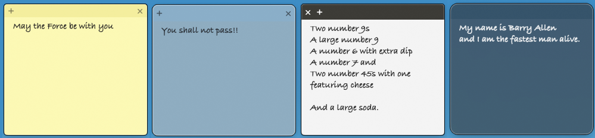

# Sticky Notes (macOS)

[](https://github.com/omanoloneto/stick-notes/actions/workflows/ci.yml)
[](LICENSE)


Sticky notes that float on your desktop — a native macOS take on the classic
**Windows 7 Sticky Notes**, with **8 OS-inspired themes** (Windows 7 → 11,
Ubuntu, classic & modern macOS). Built in Swift: AppKit-first, with SwiftUI
inside each note. No Apple Developer account, notarization, or sandbox required.

## Features

- Multiple small, borderless, draggable, resizable floating notes
- Caption bar: **+** new note, **×** delete (placement follows the theme)
- **8 OS themes** per note — right-click → Theme:
  Windows 7 · Windows 8 · Windows 10 · Windows 11 · Ubuntu Classic · Ubuntu Modern · MacOS Classic · MacOS Modern
- **6 colors** per note (independent of theme) — right-click → Color:
  yellow · blue · green · pink · purple · white
- Rich text: **⌘B** bold · **⌘I** italic · **⌘U** underline · **⌘T** strikethrough
- Auto-save (debounced) — no save button
- Restores every note's text, theme, and position on relaunch
- Off-screen guard: notes on an unplugged monitor reappear on the main screen
- Delete confirmation for non-empty notes (silent for empty ones)
- Lives in the **menu bar**; stays running with zero notes so you can make new ones
- On first launch from outside `/Applications`, offers to move itself there
  (asks once, then remembers)

## Themes

Each note carries its own theme — a complete look (background, caption bar,
corners, border, font, button placement). Default is **Windows 7**.

| Theme | Look |
|-------|------|
| Windows 7 | Aero paper, soft caption, hover buttons, small radius |
| Windows 8 | Flat Metro, square corners, always-visible caption |
| Windows 10 | Flat windowed, square, thin border, blue accent underline |
| Windows 11 | Fluent acrylic — blurred backdrop + strong color tint, big rounded corners |
| Ubuntu Classic | Unity 14.04: dark aubergine caption, **buttons left**, orange, square-ish |
| Ubuntu Modern | GNOME/Yaru: light header bar, **buttons right**, rounded, Yaru-orange accent |
| MacOS Classic | Classic Stickies paper, sheened top band + hairline, hover buttons |
| MacOS Modern | Frosted glass — full backdrop blur, faint tint, large radius |

## Screenshots

> Right-click a note → **Theme** / **Color** to see all the looks.



## Requirements

- macOS 14 (Sonoma) or newer
- Xcode 15+ / Swift 5.9+ toolchain (built & tested on Xcode 26 / Swift 6.3)

## Run

From the CLI (fastest):

```bash
swift run StickyNotes
```

As a real `.app` (menu-bar utility, no Dock icon):

```bash
scripts/bundle.sh release
open "build/Sticky Notes.app"
# install:
cp -R "build/Sticky Notes.app" /Applications/
```

Open `Package.swift` in Xcode to develop with full IDE support.

## Tests

```bash
swift test
```

Covers the off-screen frame sanitizer and the rich-text RTF round-trip
(incl. strikethrough fidelity) and the persistence envelope.

## Where data lives

```
~/Library/Application Support/co.akari.stickynotes/notes.json   (+ .bak)
```

Delete that folder to reset to a clean first-run state.

## Architecture

AppKit owns the windows; SwiftUI is the view layer inside each note.

| File | Role |
|------|------|
| `main.swift` / `AppDelegate.swift` | Entry point + orchestrator (lifecycle, menu bar, note management) |
| `NotePanel.swift` | Borderless, resizable `NSPanel` (key-capable, normal window level) |
| `NoteWindowController.swift` | One per note: bridges window ⇄ model ⇄ store, persists frame/content |
| `NoteView.swift` / `NoteStripView.swift` / `WindowDragView.swift` | SwiftUI note UI + drag handle |
| `RichTextEditor.swift` / `NoteTextView.swift` | `NSTextView` wrapper + ⌘B/I/U/T formatting |
| `NoteViewModel.swift` | Per-note observable state |
| `Note.swift` / `NoteStore.swift` | Model + JSON persistence (atomic write, debounced, backup) |
| `ThemeStyle.swift` | The 8 themes × 6 colors (`NoteTheme`, `NoteColor`, `ThemeStyle.style`) |
| `VisualEffectBackground.swift` | `NSVisualEffectView` blur for the glass/acrylic themes |
| `WindowFrameSanitizer.swift` | Off-screen / multi-monitor frame guard (unit-tested) |
| `StatusBarController.swift` / `MainMenu.swift` | Menu-bar item + shortcut routing |
| `AppRelocator.swift` | "Move to Applications" prompt on first launch (LetsMove-style) |
| `LoginItem.swift` | Optional launch-at-login (`SMAppService`, requires the `.app`) |

## Notes on the build

- Signed ad-hoc ("Sign to Run Locally"); Gatekeeper may warn on first open —
  right-click → Open, or `xattr -dr com.apple.quarantine "build/Sticky Notes.app"`.
- Sandbox is intentionally off so notes write freely to Application Support.
- Launch-at-login only works from the bundled `.app`, not `swift run`.
- 100% offline: no network, telemetry, or third-party dependencies.

## Contributing

Issues and PRs welcome — see [CONTRIBUTING.md](CONTRIBUTING.md). Adding a new OS
theme is a one-`case` change in `ThemeStyle.swift`.

## License

[MIT](LICENSE) © 2026 Manolo Neto
